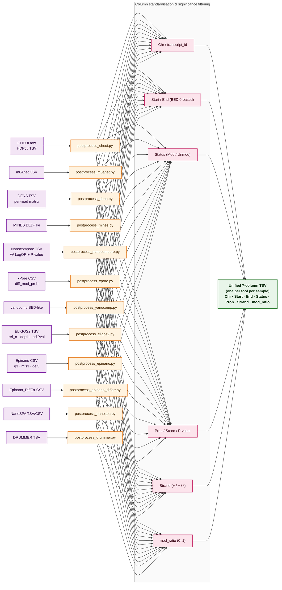
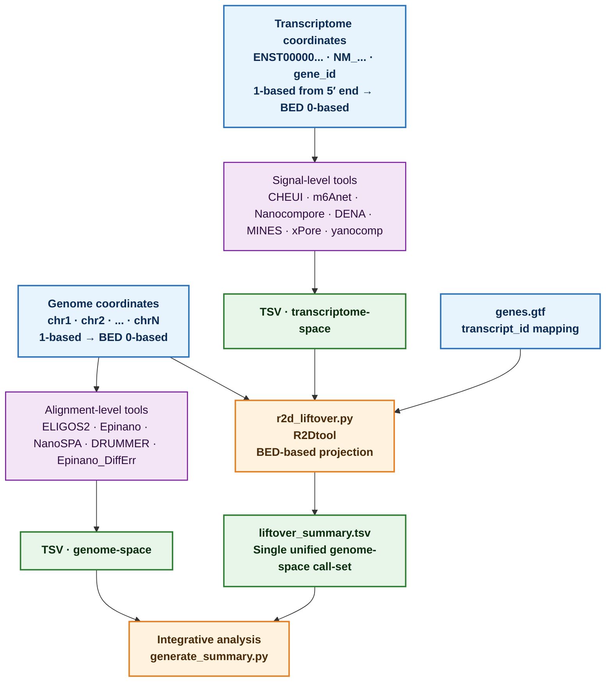

# RNAModBench Pipeline Workflow Diagrams

This document contains publication-quality flowcharts of the RNAModBench pipeline. All diagrams can be rendered to vector (SVG) or high-resolution PNG for inclusion in manuscripts.

---

## 1. Main Pipeline Workflow (Mermaid)

The following diagram shows the complete end-to-end workflow from raw FAST5 input through multi-tool integration and final report generation.

```mermaid
flowchart TD
    classDef input fill:#E8F4FD,stroke:#2D72B8,stroke-width:2px,color:#0D2C54,font-weight:bold
    classDef core fill:#FFF3E0,stroke:#E67E22,stroke-width:2px,color:#4A2C0A,font-weight:bold
    classDef sigtool fill:#F3E5F5,stroke:#7B1FA2,stroke-width:2px,color:#2D0B3E,font-weight:bold
    classDef aligntool fill:#E8F5E9,stroke:#2E7D32,stroke-width:2px,color:#0B2E0E,font-weight:bold
    classDef contrast fill:#FCE4EC,stroke:#C2185B,stroke-width:2px,color:#3E0B1B,font-weight:bold
    classDef postprocess fill:#FFF8E1,stroke:#BF8F00,stroke-width:1.5px,color:#3E2D00
    classDef summary fill:#E0F2F1,stroke:#00695C,stroke-width:2px,color:#00362E,font-weight:bold
    classDef output fill:#FFFFFF,stroke:#555,stroke-width:2px,color:#333,stroke-dasharray:5 5

    %% ============ RAW INPUT ============
    A0[FAST5]:::input --> A1[FASTQ via Guppy]:::core

    %% ============ REFERENCE INPUT ============
    R0[Reference Files]:::input --> R1[\genome.fa\]:::core
    R0 --> R2[\transcriptome.fa\]:::core
    R0 --> R3[\genes.gtf\]:::core

    %% ============ ALIGNMENT ============
    A1 --> B1[minimap2 → transcriptome BAM]:::aligntool
    A1 --> B2[minimap2 → genome BAM]:::aligntool

    %% ============ NANOPOLISH (signal tools) ============
    B1 --> C1[nanopolish eventalign]:::sigtool
    C1 --> C2[Signal-level per-site profiles]:::sigtool

    %% ============ SINGLE-SAMPLE SIGNAL TOOLS ============
    subgraph single ["Signal-level Tools · Single-sample"]
        style single fill:#FAFAFA,stroke:#999,stroke-width:1px,stroke-dasharray:5 5
        D1[CHEUI<br/>HMM + deep-learning<br/>m⁶A calling]:::sigtool --> P1[postprocess_cheui.py]:::postprocess
        D2[m6Anet<br/>Probabilistic<br/>m⁶A calling]:::sigtool --> P2[postprocess_m6anet.py]:::postprocess
        D3[DENA<br/>LSTM + Tombo<br/>m⁶A in RRACH]:::sigtool --> P3[postprocess_dena.py]:::postprocess
        D4[MINES<br/>Tombo + ML<br/>m⁶A calling]:::sigtool --> P4[postprocess_mines.py]:::postprocess
    end

    C2 --> single
    R2 --> single

    %% ============ CONTRAST SIGNAL TOOLS ============
    subgraph contrast ["Signal-level Tools · Contrast (treatment vs control)"]
        style contrast fill:#FAFAFA,stroke:#999,stroke-width:1px,stroke-dasharray:5 5
        E1[Nanocompore<br/>Sampcomp + Log-LOR<br/>GMM P-value]:::contrast --> P5[postprocess_nanocompore.py]:::postprocess
        E2[xPore<br/>DiffMod<br/>D.M. probability]:::contrast --> P6[postprocess_xpore.py]:::postprocess
        E3[yanocomp<br/>GMM-based<br/>diff testing]:::contrast --> P7[postprocess_yanocomp.py]:::postprocess
    end

    C2 --> contrast
    R2 --> contrast

    %% ============ SINGLE-SAMPLE GENOME TOOLS ============
    subgraph genome ["Alignment-level Tools · Single-sample"]
        style genome fill:#FAFAFA,stroke:#999,stroke-width:1px,stroke-dasharray:5 5
        F1[ELIGOS2<br/>Statistical mismatch<br/>RNA vs DNA comparison]:::aligntool --> P8[postprocess_eligos2.py]:::postprocess
        F2[Epinano<br/>Error-profile SVM<br/>m⁶A detection]:::aligntool --> P9[postprocess_epinano.py]:::postprocess
        F3[NanoSPA<br/>Bayesian<br/>multi-mod calling]:::aligntool --> P10[postprocess_nanospa.py]:::postprocess
    end

    B2 --> genome
    R1 --> genome

    %% ============ CONTRAST GENOME TOOLS ============
    subgraph genome_diff ["Alignment-level Tools · Contrast (treatment vs control)"]
        style genome_diff fill:#FAFAFA,stroke:#999,stroke-width:1px,stroke-dasharray:5 5
        G1[Epinano_DiffErr<br/>Differential error<br/>Fisher-exact test]:::contrast --> P11[postprocess_epinano_differr.py]:::postprocess
        G2[DRUMMER<br/>Coverage-based<br/>diff. modification]:::contrast --> P12[postprocess_drummer.py]:::postprocess
    end

    B2 --> genome_diff
    R1 --> genome_diff

    %% ============ POST-PROCESSING UNIFICATION ============
    H[Unified 7-column TSV output<br/>Chr · Start · End · Status · Prob · Strand · mod_ratio]:::summary

    P1 --> H
    P2 --> H
    P3 --> H
    P4 --> H
    P5 --> H
    P6 --> H
    P7 --> H
    P8 --> H
    P9 --> H
    P10 --> H
    P11 --> H
    P12 --> H

    %% ============ DOWNSTREAM ANALYSIS ============
    subgraph downstream ["Downstream analysis & reporting"]
        style downstream fill:#FAFAFA,stroke:#999,stroke-width:1px,stroke-dasharray:5 5
        I1[generate_summary.py<br/>Site counts · Tool overlap · Venn diagrams]:::summary
        I2[extract_5mer.py<br/>k-mer context analysis<br/>R R A C H enrichment]:::summary
        I3[create_guitar_plots.R<br/>Genic metagene profile<br/>5′UTR → CDS → 3′UTR]:::summary
        I4[generate_depth_plots.R<br/>Per-sample coverage QC]:::summary
        I5[create_report.py<br/>HTML report (Bootstrap)]:::summary
        I6[r2d_liftover.py<br/>Transcriptome→Genome<br/>coordinate liftover]:::summary
    end

    H --> I1
    H --> I2
    H --> I3
    H --> I4
    H --> I5
    H --> I6
    R3 --> I3
    R3 --> I6

    %% ============ OUTPUTS ============
    subgraph outputs ["Final Outputs"]
        style outputs fill:#FAFAFA,stroke:#555,stroke-width:1.5px
        O1[modification_summary.tsv]:::output
        O2[tool_comparison.tsv]:::output
        O3[Venn diagrams · PNG]:::output
        O4[Guitar plots · PNG/PDF]:::output
        O5[Depth plots · PNG]:::output
        O6[liftover_summary.tsv]:::output
        O7[RNAModBench_report.html]:::output
    end

    I1 --> O1
    I1 --> O2
    I1 --> O3
    I3 --> O4
    I4 --> O5
    I6 --> O6
    I5 --> O7

    %% Legend
    subgraph legend ["Legend"]
        style legend fill:#FFFFFF,stroke:#333,stroke-width:1px
        L1[Raw sequencing input]:::input
        L2[Core preprocessing step]:::core
        L3[Signal-level tool]:::sigtool
        L4[Alignment-level tool]:::aligntool
        L5[Contrast tool (paired)]:::contrast
        L6[Normalisation & post-processing]:::postprocess
        L7[Summary / reporting module]:::summary
        L8[Final output file]:::output
    end
```

---

## 2. Post-processing Sub-Workflow (Mermaid)

This diagram details how the 12 heterogeneous tool outputs are harmonised into a single unified format.



---

## 3. Coordinate System Overview (Mermaid)



---

## 4. Rendering Instructions

All three Mermaid diagrams above can be rendered in the following ways:

### 4.1 Inline — GitHub / MkDocs / Obsidian
These Mermaid blocks render directly on GitHub (since 2022) and any Mermaid-aware Markdown renderer.

### 4.2 Command-line (for publication-quality SVG)

```bash
# Install Mermaid CLI
npm install -g @mermaid-js/mermaid-cli

# Render the main flowchart as a vector SVG
mmdc -i docs/FLOWCHART.md -o docs/figures/main_workflow.svg -w 2400 -b transparent
mmdc -i docs/FLOWCHART.md -o docs/figures/postprocessing.svg -w 1800 -b transparent
mmdc -i docs/FLOWCHART.md -o docs/figures/coordinate_systems.svg -w 1800 -b transparent

# High-resolution PNG (300 dpi equivalent)
mmdc -i docs/FLOWCHART.md -o docs/figures/main_workflow.png -w 2400 -H 3200 -b "#FFFFFF"
```

### 4.3 Online editors
Alternative: paste individual `mermaid` blocks into [https://mermaid.live](https://mermaid.live) for interactive tweaking and export.

---

## 5. Graphviz (DOT) — Publication-quality Diagram

A higher-fidelity Graphviz version is available at `docs/figures/pipeline.dot` and can
be compiled to SVG/EPS/PDF with:

```bash
# Requires: graphviz (conda install -c conda-forge graphviz)
dot -Tsvg  docs/figures/pipeline.dot -o docs/figures/pipeline.svg
dot -Teps  docs/figures/pipeline.dot -o docs/figures/pipeline.eps   # LaTeX-ready
dot -Tpdf  docs/figures/pipeline.dot -o docs/figures/pipeline.pdf   # Vector PDF
dot -Tpng  docs/figures/pipeline.dot -o docs/figures/pipeline.png -Gdpi=300
```

---

## 6. Diagram Figure Legend (for manuscript copy-paste)

> **Figure 1. Overview of the RNAModBench pipeline.**
> Raw Oxford Nanopore FAST5 files are base-called with Guppy and mapped, in parallel,
> to both the transcriptome (for signal-level tools) and the genome (for
> alignment-level tools). Signal-level tools operate on nanopolish event-align profiles;
> alignment-level tools operate on base-call quality, mismatch and indel profiles.
> Modification calls are produced by each of 12 tools (single-sample or paired contrast),
> then normalised by tool-specific post-processing scripts into a unified 7-column TSV
> format. Downstream modules generate site-level summary statistics, Venn diagrams of
> inter-tool concordance, metagene profiles (Guitar plots), depth-of-coverage QC plots,
> transcriptome-to-genome coordinate liftover, and a final HTML report.
